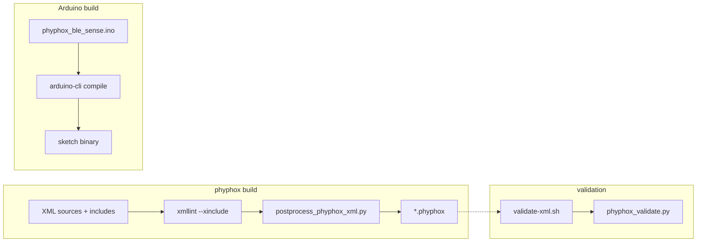
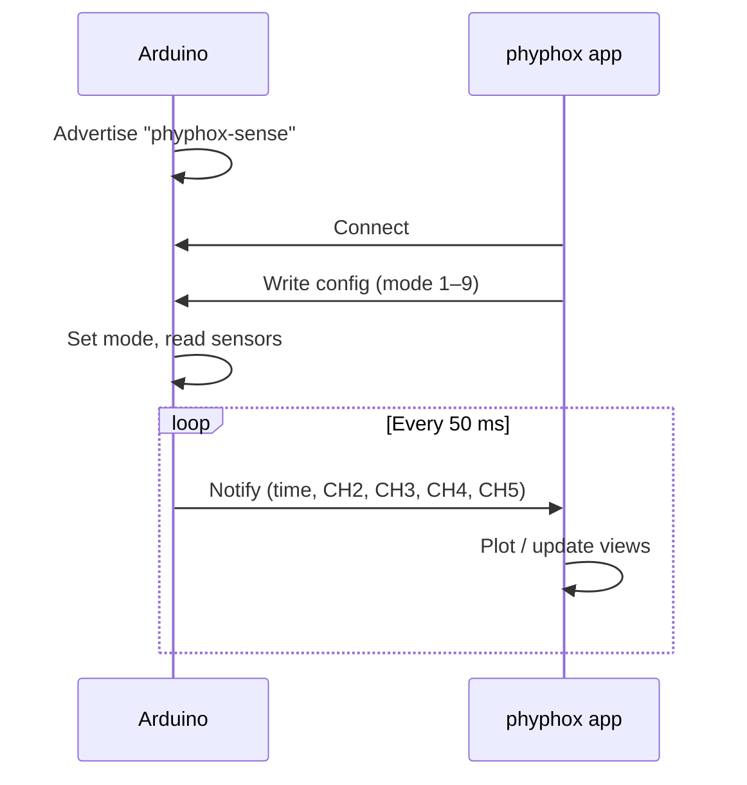
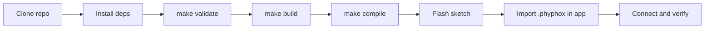

# Arduino + phyphox Experiments (Bluetooth LE)

This repository contains phyphox experiment files (`*.phyphox`) and an Arduino sketch that publishes sensor data via Bluetooth LE for the **Arduino Nano 33 BLE Sense**.

The `*.phyphox` files all use the same BLE characteristic UUIDs and a numeric "mode" written by the app (via `<output><config>…</config></output>`) to select which sensor values are streamed.

## Experiments

- `accelerometer_plot_v1-2.phyphox` (config/mode `1.0`)
- `gyroscope_plot_v1-2.phyphox` (config/mode `2.0`)
- `magnetometer_plot_v1-2.phyphox` (config/mode `3.0`)
- `pressure_plot_v1-2.phyphox` (config/mode `4.0`)
- `temperature_plot_v1-2.phyphox` (config/mode `5.0`)
- `light_plot_v1-2.phyphox` (config/mode `6.0`)
- `analog_input_plot_v1-2.phyphox` (config/mode `9.0`)

Compatibility: phyphox app 1.x; experiments v1.2.

## How it works

**Build pipeline:** Experiment sources (XML with XInclude) are expanded with `xmllint`, post-processed (strip `xml:base`, leftover namespaces), and written as `*.phyphox`. The Arduino sketch is compiled separately with `arduino-cli`. Validation runs `xmllint` and `phyphox_validate.py` on XML and built `.phyphox` files.



**Runtime:** The Arduino advertises as `phyphox-sense`. The phyphox app connects, writes a mode (1–9) to the config characteristic, and subscribes to the data characteristic. The Arduino reads the selected sensor(s), packs time and four channel values as 5× float32 LE, and notifies every 50 ms.



## Lifecycle

**Developer flow** from clone to tested device:



**User flow** (pre-built experiments): Download or clone this repo, then follow the [Quickstart](#quickstart) to flash the sketch, import an experiment into the phyphox app, and start measuring.

## Requirements

**Hardware:**

- [Arduino Nano 33 BLE Sense](https://store.arduino.cc/products/arduino-nano-33-ble-sense) (the board with built-in sensors)
- USB cable (Micro-USB) to connect the Arduino to your computer
- Smartphone or tablet with the [phyphox app](https://phyphox.org/) installed (free, available on iOS and Android)

**Software (for building/flashing):**

- [Arduino IDE](https://www.arduino.cc/en/software) or [`arduino-cli`](https://arduino.github.io/arduino-cli/) to flash the sketch onto the board
- `bash`, `python3`, `xmllint` (libxml2) -- only needed if you want to rebuild or validate the experiment files

## Quickstart

The fastest way to get an experiment running in class:

1. **Flash the Arduino sketch.** Open `arduino/phyphox_ble_sense/phyphox_ble_sense.ino` in the Arduino IDE, select board "Arduino Nano 33 BLE", and upload. (If using `arduino-cli`, run `make compile` then `arduino-cli upload -p /dev/ttyACM0 --fqbn arduino:mbed_nano:nano33ble arduino/phyphox_ble_sense`.)
2. **Import an experiment into phyphox.** Transfer one of the `*.phyphox` files from this repo to your phone (e.g., via AirDrop, email attachment, or USB). Open it with the phyphox app.
3. **Connect and measure.** In the phyphox app, tap the imported experiment. It connects to the Arduino over Bluetooth LE (device name: `phyphox-sense`). Sensor data appears as live plots.

Each `*.phyphox` file is a self-contained experiment. You can import several and switch between them -- the app tells the Arduino which sensor to stream.

### Developer commands

```sh
make validate          # Validate XML and phyphox files
make build             # Rebuild *.phyphox from src/phyphox/*.phyphox.xml
make compile           # Compile Arduino sketch (requires arduino-cli)
```

Full dev loop including security checks:

```sh
make validate && make build && make compile
make security
```

## Configuration

No runtime configuration is required. BLE UUIDs and experiment mode IDs are defined in:

- `arduino/phyphox_ble_sense/phyphox_ble_sense.ino`
- `src/phyphox/*.phyphox.xml`

## Manual device test (optional)

Follow the [Quickstart](#quickstart) steps to flash and import, then verify:

- The plot updates with live sensor data after connecting.
- Switching to a different `*.phyphox` experiment changes the streamed sensor (e.g., accelerometer vs. gyroscope).

## Security

Minimal security checks:

```sh
make security
```

This runs:

- `scripts/secret-scan.sh` — secret pattern scan
- `scripts/deps-scan.sh` — dependency pin check (Arduino core/libs in `scripts/compile-arduino.sh`)
- `scripts/sast-minimal.sh` — shell syntax and Python bytecode checks

## Troubleshooting

**Bluetooth / phyphox app:**

- **Arduino not found in phyphox:** Make sure the Arduino is powered and not connected to another device. Bluetooth LE does not show up in the system Bluetooth settings -- the phyphox app handles the connection directly.
- **No data / flat plot:** Check that you imported the correct `*.phyphox` file for the sensor you want. Each experiment selects a different sensor mode on the Arduino.
- **Board not advertising after flash:** Power-cycle the Arduino. If it still does not advertise as `phyphox-sense`, re-flash the sketch.

**Build tools:**

- `xmllint: command not found`: Install `libxml2` (e.g. `brew install libxml2` on macOS, `apt install libxml2-utils` on Debian/Ubuntu) and ensure `xmllint` is in `PATH`.
- `python3: command not found`: Install Python 3 and ensure it is in `PATH`.
- `arduino-cli not found`: Install `arduino-cli` (e.g. `brew install arduino-cli` on macOS) and retry `make compile`.

## Repo structure

- `*.phyphox` — generated phyphox experiments (importable; kept in repo so clone-and-import works without building)
- `src/phyphox/*.phyphox.xml` — source XML with XInclude
- `src/phyphox/includes/` — shared snippets (containers, BLE channel mapping)
- `arduino/phyphox_ble_sense/` — Arduino BLE sketch
- `scripts/` — validate-xml.sh, build-phyphox.sh (optional: `PHYPHOX_OUTDIR` for output dir), compile-arduino.sh, security scripts
- `tools/` — postprocess_phyphox_xml.py, phyphox_validate.py

## Further documentation

- [docs/REPO_MAP.md](docs/REPO_MAP.md) — technical map (entrypoints, hot spots)
- [docs/ci/](docs/ci/) — CI overview and ADR

## More information

German usage notes: https://astro-lab.app/arduino-und-phyphox/

## License

GPL-3.0 (see `LICENSE`).
