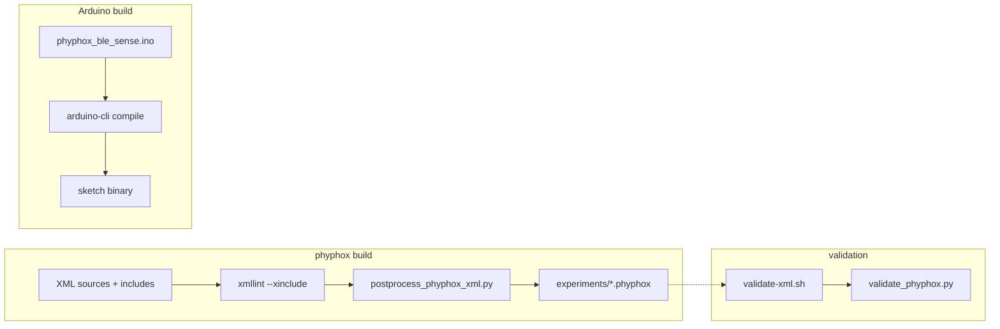
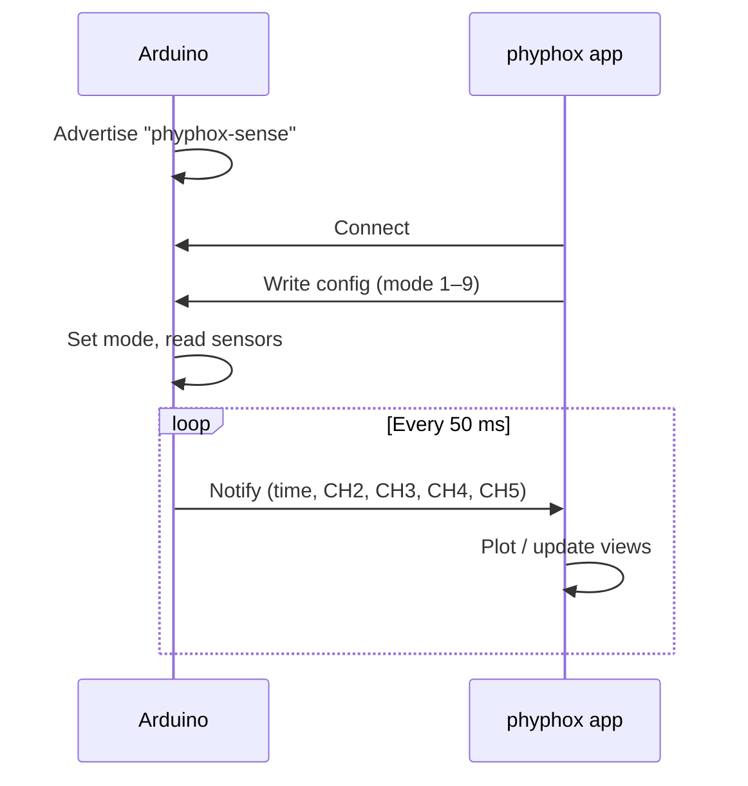
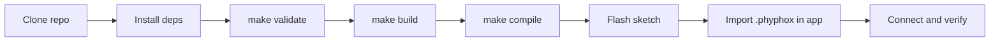

# Phyphox Arduino Classroom Kit

This repository consolidates the former `arduino-phyphox-experiments` and `smartphone-based-exoplanet-detection` work into one classroom-ready Arduino Nano 33 BLE Sense plus phyphox kit.

It keeps one canonical Arduino firmware surface in `arduino/phyphox_ble_sense/`, one phyphox authoring source tree in `src/phyphox/`, committed importable sensor experiments in `experiments/`, and a curated astronomy teaching subtree in `experiments/astronomy/`.

The phyphox files all use the same BLE characteristic UUIDs and a numeric mode written by the app via `<output><config>...</config></output>` to select which sensor values are streamed.

## Why this repo exists

The older exoplanet-focused framing was too narrow for the actual project boundary. The classroom kit supports multiple sensor experiments:

- motion and rotation
- magnetic field mapping
- pressure and environmental measurements
- light and color measurements
- analog input experiments

Exoplanet transit simulation remains one classroom example for the light sensor, not the repository identity.

The astronomy subtree is now also maintained as a separate didactic surface with:

- one canonical `.phyphox` file per astronomy concept
- English root locale plus German and French translations
- automatic fallback to English when the phone language is not `en`, `de`, or `fr`

The astronomy files are not part of the Arduino `phyphox-sense` runtime path unless stated otherwise. They use phone sensors, TI SensorTag hardware, or the supported Owon multimeter.

## Experiments

### Core sensor experiments

- `accelerometer_plot_v1-2.phyphox` (config/mode `1.0`)
- `gyroscope_plot_v1-2.phyphox` (config/mode `2.0`)
- `magnetometer_plot_v1-2.phyphox` (config/mode `3.0`)
- `pressure_plot_v1-2.phyphox` (config/mode `4.0`)
- `temperature_plot_v1-2.phyphox` (config/mode `5.0`)
- `light_plot_v1-2.phyphox` (config/mode `6.0`)
- `analog_input_plot_v1-2.phyphox` (config/mode `9.0`)

Import the generated files from `experiments/`. Compatibility target: phyphox app 1.x; experiments v1.2.

### Astronomy experiments

Import these files from `experiments/astronomy/`:

- `albedo.phyphox`
- `greenhouse.phyphox`
- `ir-dist_habitable.phyphox`
- `missiontomars.phyphox`
- `owon_digital_multimeter-debug.phyphox`
- `pt-star.phyphox`
- `tidal-locking.phyphox`
- `transitmethode.phyphox`

The astronomy files are classroom analogies or bounded model experiments, not standalone scientific calculators. Their measurement paths, physical claims, and didactic limits are documented in the companion file linked below.

## How it works

**Core sensor build pipeline:** Experiment sources (XML with XInclude) are expanded with `xmllint`, post-processed (strip `xml:base`, leftover namespaces), and written to `experiments/*.phyphox`. The Arduino sketch is compiled separately with `arduino-cli`. Validation runs `xmllint` and `tools/validate_phyphox.py` on generated files and expanded source output.



**Core sensor runtime:** The Arduino advertises as `phyphox-sense`. The phyphox app connects, writes a mode (1–9) to the config characteristic, and subscribes to the data characteristic. The Arduino reads the selected sensor(s), packs time and four channel values as 5× float32 LE, and notifies every 50 ms.



## Lifecycle

**Developer flow** from clone to tested device:



**User flow** (pre-built experiments): Download or clone this repo, then follow the [Quickstart](#quickstart) to flash the sketch, import an experiment into the phyphox app, and start measuring.

## Requirements

**Hardware:**

- [Arduino Nano 33 BLE Sense](https://store.arduino.cc/products/arduino-nano-33-ble-sense) (the board with built-in sensors)
- USB cable (Micro-USB) to connect the Arduino to your computer
- Smartphone or tablet with the [phyphox app](https://phyphox.org/) installed (free, available on iOS and Android)

**Software (for building/flashing):**

- [Arduino IDE](https://www.arduino.cc/en/software) or [`arduino-cli`](https://arduino.github.io/arduino-cli/) to flash the sketch onto the board
- `bash`, `python3`, `xmllint` (libxml2) -- only needed if you want to rebuild or validate the experiment files

## Quickstart

### Core sensor experiments

Use this flow for the files in `experiments/*.phyphox`:

1. **Flash the Arduino sketch.** Open `arduino/phyphox_ble_sense/phyphox_ble_sense.ino` in the Arduino IDE, select board "Arduino Nano 33 BLE", and upload. (If using `arduino-cli`, run `make compile` then `arduino-cli upload -p /dev/ttyACM0 --fqbn arduino:mbed_nano:nano33ble arduino/phyphox_ble_sense`.)
2. **Import an experiment into phyphox.** Transfer one of the files from `experiments/` to your phone (e.g., via AirDrop, email attachment, or USB). Open it with the phyphox app.
3. **Connect and measure.** In the phyphox app, tap the imported experiment. It connects to the Arduino over Bluetooth LE (device name: `phyphox-sense`). Sensor data appears as live plots.

Each file in `experiments/` is a self-contained experiment. You can import several and switch between them; the app tells the Arduino which sensor to stream.

### Astronomy experiments

Use this flow for the files in `experiments/astronomy/*.phyphox`:

1. **Choose the required sensor path.**
   - Some files use the phone sensor directly.
   - Some require a TI SensorTag.
   - `transitmethode.phyphox` can also use a solar cell on the supported Owon multimeter.
2. **Import the file into phyphox.** Transfer one of the files from `experiments/astronomy/` to your phone and open it with the phyphox app.
3. **Run the experiment with the matching hardware path.** Do not expect these astronomy files to connect to `phyphox-sense` unless the individual file explicitly targets that Arduino runtime, which the current astronomy subtree does not.

### Developer commands

```sh
ruff check .
ruff format --check .
pytest
make validate          # Validate XML and phyphox files
make build             # Rebuild *.phyphox from src/phyphox/*.phyphox.xml
make compile           # Compile Arduino sketch (requires arduino-cli)
make ci-local          # Full local CI entrypoint
```

Full dev loop including security checks:

```sh
make ci-local
```

## Configuration

No runtime configuration is required. BLE UUIDs and experiment mode IDs are defined in:

- `experiments/phyphox_constants.json`
- `arduino/phyphox_ble_sense/phyphox_ble_sense.ino`
- `src/phyphox/*.phyphox.xml`

## Manual device test (optional)

For core sensor experiments, follow the [core sensor quickstart](#core-sensor-experiments) and verify:

- The plot updates with live sensor data after connecting.
- Switching to a different experiment changes the streamed sensor (e.g., accelerometer vs. gyroscope).

For astronomy experiments, verify instead that the selected file matches the required phone/SensorTag/Owon path and that the lesson framing matches the companion document.

## Security

Minimal security checks:

```sh
make security
```

This runs:

- `scripts/secret-scan.sh` — secret pattern scan
- `scripts/deps-scan.sh` — dependency pin check (Arduino core/libs in `scripts/compile-arduino.sh`)
- `scripts/sast-minimal.sh` — shell syntax and Python bytecode checks

## Troubleshooting

**Bluetooth / phyphox app:**

- **Arduino not found in phyphox:** Make sure the Arduino is powered and not connected to another device. Bluetooth LE does not show up in the system Bluetooth settings -- the phyphox app handles the connection directly.
- **No data / flat plot:** Check that you imported the correct file from `experiments/` for the sensor you want. Each experiment selects a different sensor mode on the Arduino.
- **Board not advertising after flash:** Power-cycle the Arduino. If it still does not advertise as `phyphox-sense`, re-flash the sketch.

**Build tools:**

- `xmllint: command not found`: Install `libxml2` (e.g. `brew install libxml2` on macOS, `apt install libxml2-utils` on Debian/Ubuntu) and ensure `xmllint` is in `PATH`.
- `python3: command not found`: Install Python 3 and ensure it is in `PATH`.
- `arduino-cli not found`: Install `arduino-cli` (e.g. `brew install arduino-cli` on macOS) and retry `make compile`.

## Repo structure

- `experiments/*.phyphox` — generated core sensor phyphox experiments (importable; kept in repo so clone-and-import works without building)
- `experiments/astronomy/*.phyphox` — importable astronomy classroom experiments with `en` root locale and `de` / `fr` translations
- `experiments/phyphox_constants.json` — shared BLE UUID and mode metadata
- `src/phyphox/*.phyphox.xml` — source XML with XInclude
- `src/phyphox/includes/` — shared snippets (containers, BLE channel mapping)
- `arduino/phyphox_ble_sense/` — Arduino BLE sketch
- `scripts/` — validate/build/compile/security/local CI entrypoints
- `tools/` — postprocess and phyphox validation helpers

## Further documentation

- [docs/REPO_MAP.md](docs/REPO_MAP.md) — technical map (entrypoints, hot spots)
- [docs/RUNBOOK.md](docs/RUNBOOK.md) — reproducible setup and verification loop
- [docs/ASTRONOMY_EXPERIMENTS_COMPANION.md](docs/ASTRONOMY_EXPERIMENTS_COMPANION.md) — astronomy experiment companion covering method, physics basis, didactic goal, and scope limits
- [docs/deprecated/audit/README.md](docs/deprecated/audit/README.md) — archived audit workspace, remediation runbook, and progress ledger
- [docs/ci.md](docs/ci.md) — CI matrix overview
- [arduino/phyphox_ble_sense/README.md](arduino/phyphox_ble_sense/README.md) — BLE UUIDs, data layout, mode mapping, and Arduino sketch behaviour
- [CONTRIBUTING.md](CONTRIBUTING.md) — maintainer workflow

## More information

German usage notes: https://astro-lab.app/arduino-und-phyphox/

## License

GPL-3.0 (see `LICENSE`).
