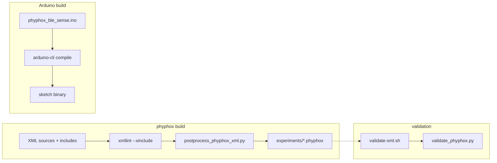
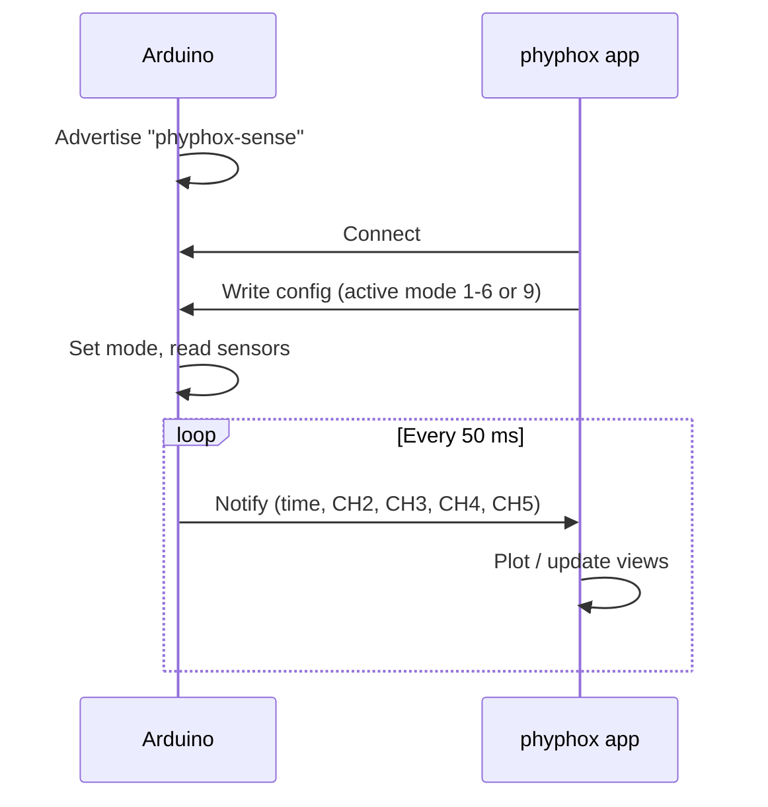
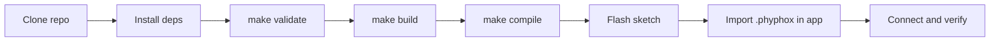

# Phyphox Arduino Classroom Kit

This repository contains firmware and phyphox experiment files for collecting
sensor data from an original Arduino Nano 33 BLE Sense over Bluetooth Low
Energy. It also contains a separate set of astronomy classroom experiments for
phone sensors, TI SensorTags, a Bluetooth HID mouse, and Owon multimeters.

No public release has been published. See [RELEASE_STATUS.md](RELEASE_STATUS.md)
for the current verification record and publication blockers.

## Scope

The repository has two experiment sets:

- Seven core experiments in `experiments/*.phyphox`. These files are generated
  from `src/phyphox/*.phyphox.xml` and communicate with the Arduino firmware.
- Eight astronomy files in `experiments/astronomy/`. These files are maintained
  directly and do not use the Arduino firmware.

The firmware targets the original Nano 33 BLE Sense with the LSM9DS1, HTS221,
LPS22HB, and APDS9960 sensors. Nano 33 BLE Sense Rev2 is not supported.

## Capabilities

| Mode | Core experiment | Input | Values |
| --- | --- | --- | --- |
| 1 | `accelerometer_plot_v1-2.phyphox` | LSM9DS1 accelerometer | x, y, z, magnitude |
| 2 | `gyroscope_plot_v1-2.phyphox` | LSM9DS1 gyroscope | x, y, z, magnitude |
| 3 | `magnetometer_plot_v1-2.phyphox` | LSM9DS1 magnetometer | x, y, z, magnitude |
| 4 | `pressure_plot_v1-2.phyphox` | LPS22HB barometer | pressure |
| 5 | `temperature_plot_v1-2.phyphox` | HTS221 sensor | temperature, humidity |
| 6 | `light_plot_v1-2.phyphox` | APDS9960 sensor | clear, red, green, blue |
| 9 | `analog_input_plot_v1-2.phyphox` | A0, A1, A2 | raw ADC values, inferred mV |

The astronomy set covers reflected light, comparative warming, thermal response
to distance, pressure, coupled pressure and temperature trends, tidal locking,
and transit light curves. The habitable-zone analogue uses a Bluetooth HID
mouse as an uncalibrated distance input. The Owon decoder branches are labeled
for the B35T and W18B models in the experiment XML.
`owon_digital_multimeter-debug.phyphox` is an instrumentation helper for the
multimeter transit path. See the
[astronomy experiments companion](docs/ASTRONOMY_EXPERIMENTS_COMPANION.md) for
the measurement path and interpretation limits of each file.

The static classroom preview lives in `demo/` and uses deterministic fixture
data with clearly marked simulated controls. Public deployment is disabled
while distribution rights remain unresolved; the repository remains the source
of truth.

## Limitations

- The supported classroom topology is one powered board within discovery range
  at a time. Multi-board discovery is not supported: every board advertises as
  `phyphox-sense` with the same service UUID, so nearby boards are
  indistinguishable in the app.
- A failed or unavailable sensor sample is transmitted as `NaN`. The firmware
  has no detailed status characteristic, serial diagnostic, or LED error code.
- A BLE initialization failure stops the sketch in a delay loop without a
  visible diagnostic.
- Automated checks compile the firmware but do not test a physical board, BLE
  radio behavior, external circuits, or the phyphox mobile application.
- Astronomy hardware paths and translated application views are not exercised
  automatically.
- The experiment files do not identify a specific compatible TI SensorTag
  generation. Owon B35T and W18B decoder branches are present in source, but
  current hardware compatibility has not been verified.
- Python development dependencies use bounded version ranges, not a hash-locked
  environment.
- Component license scope and embedded asset provenance are not resolved. See
  [License status](#license-status).

## Experiments

### Core sensor experiments

- `accelerometer_plot_v1-2.phyphox` (config/mode `1.0`)
- `gyroscope_plot_v1-2.phyphox` (config/mode `2.0`)
- `magnetometer_plot_v1-2.phyphox` (config/mode `3.0`)
- `pressure_plot_v1-2.phyphox` (config/mode `4.0`)
- `temperature_plot_v1-2.phyphox` (config/mode `5.0`)
- `light_plot_v1-2.phyphox` (config/mode `6.0`)
- `analog_input_plot_v1-2.phyphox` (config/mode `9.0`)

Import the generated files from `experiments/`. Compatibility target: phyphox app 1.x; experiments v1.2.

### Astronomy experiments

Import these files from `experiments/astronomy/`:

- `albedo.phyphox`
- `greenhouse.phyphox`
- `ir-dist_habitable.phyphox`
- `missiontomars.phyphox`
- `pt-star.phyphox`
- `tidal-locking.phyphox`
- `transitmethode.phyphox`

Auxiliary hardware helper:

- `owon_digital_multimeter-debug.phyphox` is a supported Owon multimeter debug
  and integration utility, not an astronomy teaching experiment.

The astronomy files are classroom analogies or bounded model experiments, not standalone scientific calculators. Their measurement paths, physical claims, and didactic limits are documented in the companion file linked below.

## How it works

**Core sensor build pipeline:** Experiment sources (XML with XInclude) are expanded with `xmllint`, post-processed (strip `xml:base`, leftover namespaces), and written to `experiments/*.phyphox`. The Arduino sketch is compiled separately with `arduino-cli`. Validation runs `xmllint` and `tools/validate_phyphox.py` on generated files and expanded source output.


```mermaid
flowchart LR
  subgraph phyphoxBuild [phyphox build]
    xmlSources[XML sources + includes]
    xmllint[xmllint --xinclude]
    postprocess[postprocess_phyphox_xml.py]
    phyphoxFiles["experiments/*.phyphox"]
    xmlSources --> xmllint --> postprocess --> phyphoxFiles
  end
  subgraph arduinoBuild [Arduino build]
    sketch[phyphox_ble_sense.ino]
    arduinoCli[arduino-cli compile]
    binary[sketch binary]
    sketch --> arduinoCli --> binary
  end
  subgraph validation [validation]
    validate[validate-xml.sh]
    phyphoxValidate[validate_phyphox.py]
    phyphoxFiles -.-> validate
    validate --> phyphoxValidate
  end
```

**Core sensor runtime:** The Arduino advertises as `phyphox-sense`. The phyphox app connects, writes an active mode (`1`-`6` or `9`) to the config characteristic, and subscribes to the data characteristic. The Arduino reads the selected sensor(s), packs time and four channel values as 5× float32 LE, and notifies every 50 ms.


```mermaid
sequenceDiagram
  participant Arduino
  participant App as phyphox app
  Arduino->>Arduino: Advertise "phyphox-sense"
  App->>Arduino: Connect
  App->>Arduino: Write config (active mode 1-6 or 9)
  Arduino->>Arduino: Set mode, read sensors
  loop Every 50 ms
    Arduino->>App: Notify (time, CH2, CH3, CH4, CH5)
    App->>App: Plot / update views
  end
```

## Lifecycle

**Developer flow** from clone to tested device:


```mermaid
flowchart LR
  clone[Clone repo]
  installDeps[Install deps]
  validate[make validate]
  build[make build]
  compile[make compile]
  flash[Flash sketch]
  importInApp[Import .phyphox in app]
  connectAndTest[Connect and verify]
  clone --> installDeps --> validate --> build --> compile --> flash --> importInApp --> connectAndTest
```

**User flow** (pre-built experiments): Download or clone this repo, then follow the [Quickstart](#quickstart) to flash the sketch, import an experiment into the phyphox app, and start measuring.

## Requirements

Core experiment use requires:

- an [original Arduino Nano 33 BLE Sense](https://docs.arduino.cc/hardware/nano-33-ble-sense/),
  not Rev2
- a Micro-B USB data cable
- a phone or tablet with [phyphox](https://phyphox.org/)
- Arduino IDE or `arduino-cli` for compiling and uploading the sketch

The board uses 3.3 V I/O and is not 5 V tolerant. Consult the
[board datasheet](https://docs.arduino.cc/resources/datasheets/ABX00031-datasheet.pdf)
before connecting external circuits.

Repository development uses:

- Python 3.11, matching CI
- Bash
- `xmllint` from libxml2
- `arduino-cli`
- `ruff` and `pytest` from `requirements-test.txt`
- `ripgrep` and `shellcheck` for the local security checks
- `zip` for `make bundle`

## Quickstart

### Core sensor quickstart

Use this flow for the files in `experiments/*.phyphox`:

1. **Flash the Arduino sketch.** Open `arduino/phyphox_ble_sense/phyphox_ble_sense.ino` in the Arduino IDE, select board "Arduino Nano 33 BLE", and upload. (If using `arduino-cli`, run `make compile` then `arduino-cli upload -p /dev/ttyACM0 --fqbn arduino:mbed_nano:nano33ble arduino/phyphox_ble_sense`.)
2. **Import an experiment into phyphox.** Transfer one of the files from `experiments/` to your phone (e.g., via AirDrop, email attachment, or USB). Open it with the phyphox app.
3. **Connect and measure.** In the phyphox app, tap the imported experiment. It connects to the Arduino over Bluetooth LE (device name: `phyphox-sense`). Sensor data appears as live plots.

Each file in `experiments/` is a self-contained experiment. You can import several and switch between them; the app tells the Arduino which sensor to stream.

### Astronomy quickstart

Use this flow for the files in `experiments/astronomy/*.phyphox`:

1. **Choose the required sensor path.**
   - Some files use the phone sensor directly.
   - Some require a TI SensorTag.
   - `transitmethode.phyphox` can also use a solar cell on the supported Owon multimeter.
2. **Import the file into phyphox.** Transfer one of the files from `experiments/astronomy/` to your phone and open it with the phyphox app.
3. **Run the experiment with the matching hardware path.** Do not expect these astronomy files to connect to `phyphox-sense` unless the individual file explicitly targets that Arduino runtime, which the current astronomy subtree does not.

## Installation

```sh
git clone https://github.com/sebastianspicker/phyphox-arduino-classroom-kit.git
cd phyphox-arduino-classroom-kit
python3 -m venv .venv
source .venv/bin/activate
python -m pip install -r requirements-test.txt
```

On macOS with Homebrew:

```sh
brew install libxml2 arduino-cli ripgrep shellcheck
```

On Debian or Ubuntu, install `libxml2-utils`, `ripgrep`, `shellcheck`, and
`zip` from the system package manager. Install Arduino CLI using its
[official installation instructions](https://arduino.github.io/arduino-cli/latest/installation/).

The compile script installs these pinned Arduino packages if needed:

- `arduino:mbed_nano@4.5.0`
- `ArduinoBLE@1.5.0`
- `Arduino_LSM9DS1@1.1.1`
- `Arduino_HTS221@1.0.0`
- `Arduino_LPS22HB@1.0.2`
- `Arduino_APDS9960@1.0.4`

Package index updates and missing package installations require network access.

## Configuration

There is no runtime configuration file and no required repository secret.
Shared BLE values are defined in:

- `experiments/phyphox_constants.json`
- `arduino/phyphox_ble_sense/phyphox_ble_sense.ino`
- `src/phyphox/*.phyphox.xml`

| BLE field | Value |
| --- | --- |
| Device name | `phyphox-sense` |
| Service | `cddf0001-30f7-4671-8b43-5e40ba53514a` |
| Data characteristic | `cddf1002-30f7-4671-8b43-5e40ba53514a` |
| Config characteristic | `cddf1003-30f7-4671-8b43-5e40ba53514a` |

For core sensor experiments, follow the [core sensor quickstart](#core-sensor-quickstart) and verify:

- The plot updates with live sensor data after connecting.
- Switching to a different experiment changes the streamed sensor (e.g., accelerometer vs. gyroscope).

For astronomy experiments, verify instead that the selected file matches the required phone/SensorTag/Owon path and that the lesson framing matches the companion document.

`scripts/build-phyphox.sh` writes to `experiments/` by default. Set
`PHYPHOX_OUTDIR` or pass an output directory as its first argument to write
elsewhere:

```sh
PHYPHOX_OUTDIR=/tmp/phyphox-output bash scripts/build-phyphox.sh
```

The positional argument takes precedence over `PHYPHOX_OUTDIR`.

## Usage

Compile the firmware:

```sh
make compile
```

This command installs the pinned Arduino core and libraries, then compiles the
sketch. It does not upload firmware.

List connected boards and upload the sketch:

```sh
arduino-cli board list
arduino-cli upload -p <serial-port> \
  --fqbn arduino:mbed_nano:nano33ble \
  arduino/phyphox_ble_sense
```

The upload command has not been verified in this repository state because it
requires a connected board.

To use a core experiment:

1. Transfer one root file from `experiments/` to the phone or tablet.
2. Open the file with phyphox.
3. Start the experiment and select `phyphox-sense`.
4. Confirm that the expected channels update.

To use an astronomy experiment, import a file from
`experiments/astronomy/` and follow its in-file instructions. Required hardware
depends on the experiment.

## BLE data contract

The data characteristic sends a 20-byte notification no more frequently than
every 50 ms. It contains five little-endian `float32` values:

| Byte offset | Value |
| --- | --- |
| 0 | device time in seconds |
| 4 | first mode value |
| 8 | second mode value |
| 12 | third mode value |
| 16 | fourth mode value |

The config characteristic accepts one little-endian `float32`. Finite values in
the range `[0.5, 9.5)` are rounded to the nearest integer. Modes 1 through 6 and
9 are active. Modes 7 and 8 are reserved. Invalid, reserved, non-finite, and
incorrectly sized writes leave the active mode unchanged. Reading the
characteristic returns the normalized active mode.

See [the firmware protocol notes](arduino/phyphox_ble_sense/README.md) for the
channel mapping and failure behavior.

## Repository structure

| Path | Purpose |
| --- | --- |
| `arduino/phyphox_ble_sense/` | Firmware and BLE protocol notes |
| `src/phyphox/` | Editable sources for the seven core experiments |
| `src/phyphox/includes/` | Shared XInclude fragments |
| `experiments/` | Generated core files, constants, and astronomy files |
| `tools/` | XML postprocessing and validation programs |
| `scripts/` | Build, validation, compile, and security entry points |
| `tests/` | Python contract and regression tests |
| `docs/` | Architecture, operation, CI, and astronomy reference |

The detailed data and validation flows are in
[docs/REPO_MAP.md](docs/REPO_MAP.md).

## Development workflow

Edit core experiment definitions in `src/phyphox/`, then regenerate and check
the tracked outputs:

```sh
make build
make check-generated
make validate
```

Do not edit root `experiments/*.phyphox` files directly. Astronomy files are
hand-maintained and are not processed by `scripts/build-phyphox.sh`.

The standard local checks are:

```sh
make lint
make test
make validate
make check-generated
make security
```

The full local entry point also compiles the firmware:

```sh
make ci-local
```

See [docs/RUNBOOK.md](docs/RUNBOOK.md) for change-specific procedures.

## Testing

The Python suite checks:

- core and astronomy file inventories
- XInclude path boundaries
- BLE UUID, mode, offset, and config consistency
- validator and postprocessor behavior
- localization and selected physics and teaching contracts
- local Markdown links and repository guardrails

`make check-generated` performs the separate byte-for-byte source parity check.

Run individual checks through the Makefile:

```sh
make lint
make test
make validate
make check-generated
make compile
make security
```

These checks do not replace testing on the supported board and in the phyphox
application.

## Deployment and operation

This repository does not deploy a service and has no automated firmware upload
or release workflow. Operation consists of compiling and manually uploading the
sketch, then importing experiment files into phyphox.

To create a zip containing the seven core experiment files:

```sh
make bundle
```

`make bundle` regenerates the root experiments first. It does not include
`experiments/astronomy/`.

## Troubleshooting

If `ruff` or `pytest` is missing, activate `.venv` and reinstall
`requirements-test.txt`.

- **Arduino not found in phyphox:** Make sure the Arduino is powered and not connected to another device. Bluetooth LE does not show up in the system Bluetooth settings -- the phyphox app handles the connection directly.
- **No data / flat plot:** Check that you imported the correct file from `experiments/` for the sensor you want. Each experiment selects a different sensor mode on the Arduino. If the selected sensor is unavailable or has no fresh sample, the firmware sends `NaN` for the affected channels; treat blank, missing, or `NaN` values as an unavailable-sensor condition, not as a real zero reading.
- **Board not advertising after flash:** Power-cycle the Arduino. If it still does not advertise as `phyphox-sense`, re-flash the sketch.

If `xmllint` is missing, install libxml2 utilities and confirm that `xmllint`
is on `PATH`.

If Arduino package installation fails, confirm network access and retry
`make compile`. Keep the version pins intact.

If generated parity fails, run `make build`, inspect the source and generated
diff, then rerun `make check-generated`.

If channels remain `NaN`, confirm that the board is the original Nano 33 BLE
Sense and that the pinned sensor libraries are installed. A missing sensor
sample is represented as `NaN`, not zero.

If the board is not visible in phyphox, confirm that it is powered and not
connected to another central, then power-cycle and reflash it. Connect from
phyphox rather than the operating system Bluetooth settings.

## Security considerations

The XInclude validator permits only repository-owned files below
`src/phyphox/includes/`. It rejects URLs, absolute paths, parent traversal,
queries, fragments, missing files, and resolved paths outside that directory.

Do not commit credentials, private device identifiers, local captures, caches,
or generated bundles. The local security scripts perform narrow secret,
dependency constraint, shell, and Python syntax checks. They do not replace
firmware review, dependency advisory review, hardware testing, or electrical
safety review.

Report vulnerabilities according to [SECURITY.md](SECURITY.md).

## Contributing

Read [CONTRIBUTING.md](CONTRIBUTING.md) before changing firmware, generated
experiments, astronomy content, or protocol values. Changes should state the
commands run, hardware tests performed or skipped, compatibility impact, and
license or attribution impact.

## Documentation

- [Development runbook](docs/RUNBOOK.md)
- [Repository map](docs/REPO_MAP.md)
- [Continuous integration](docs/ci.md)
- [Astronomy experiments companion](docs/ASTRONOMY_EXPERIMENTS_COMPANION.md)
- [Firmware protocol](arduino/phyphox_ble_sense/README.md)
- [Core source ownership and attribution](src/phyphox/README.md)
- [Release status](RELEASE_STATUS.md)

## License status

The root [LICENSE](LICENSE) file contains GNU GPL version 3 text. Core source
and generated experiment comments state `LGPL-3.0-or-later`. The scope of these
statements has not been reconciled. Astronomy content authorship and embedded
asset provenance also require confirmation. Public distribution remains
blocked until maintainers document component-level terms.
